# דיאגרמת זרימת נתונים - Data Flow Diagram (DFD)

## 🔄 DFD רמה 0 - Context Diagram

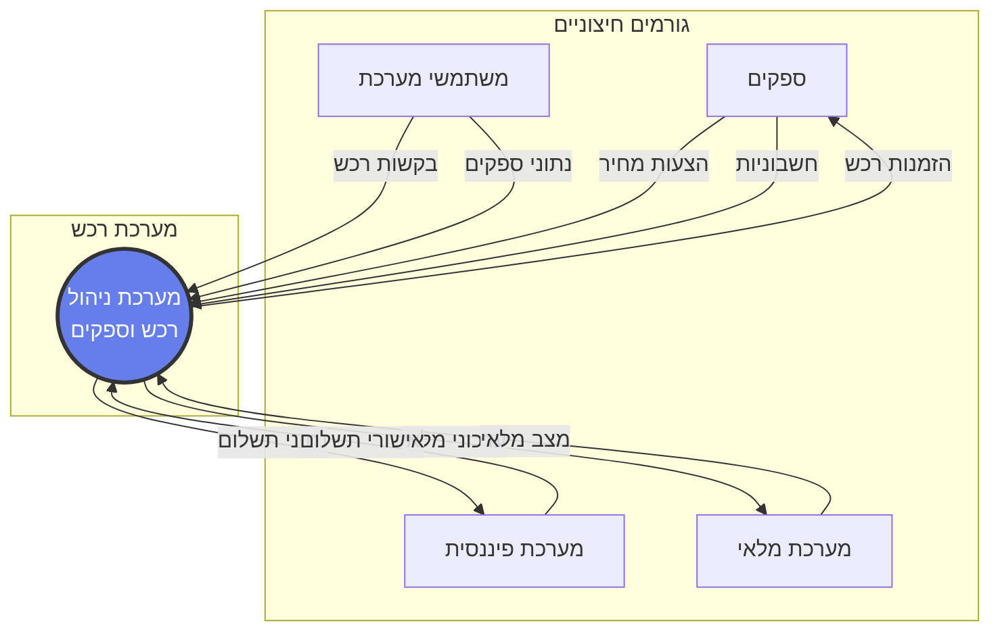

## 📊 DFD רמה 1 - תהליכים ראשיים

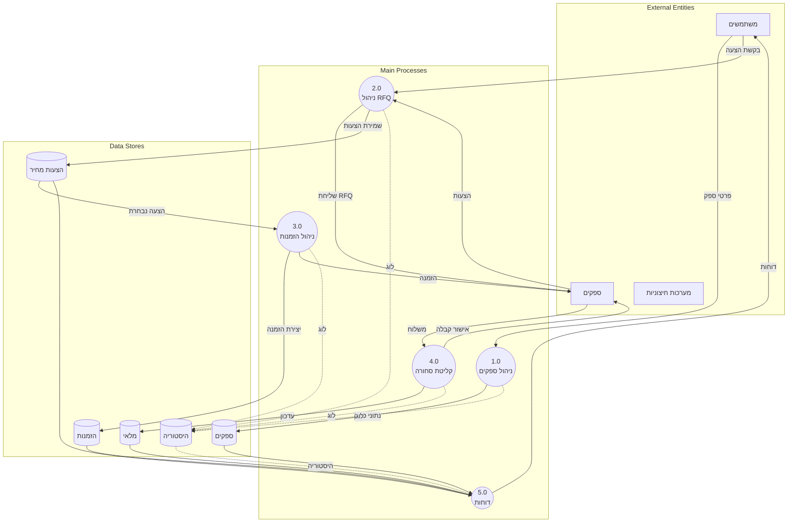

## 🔍 DFD רמה 2 - פירוט תהליך RFQ

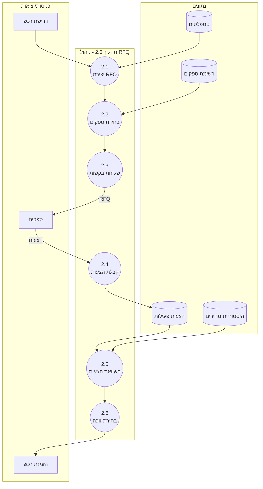

## 💾 זרימת נתונים במסד הנתונים

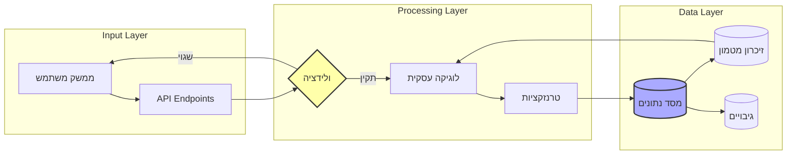

## 🔐 זרימת אבטחת מידע

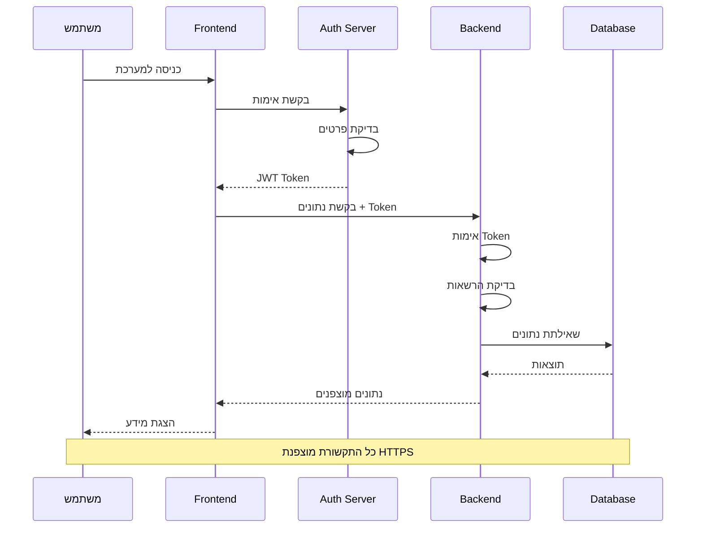

## 📈 זרימת נתונים סטטיסטיים

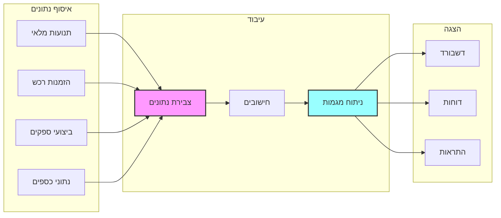

## 🔄 תהליך סנכרון נתונים

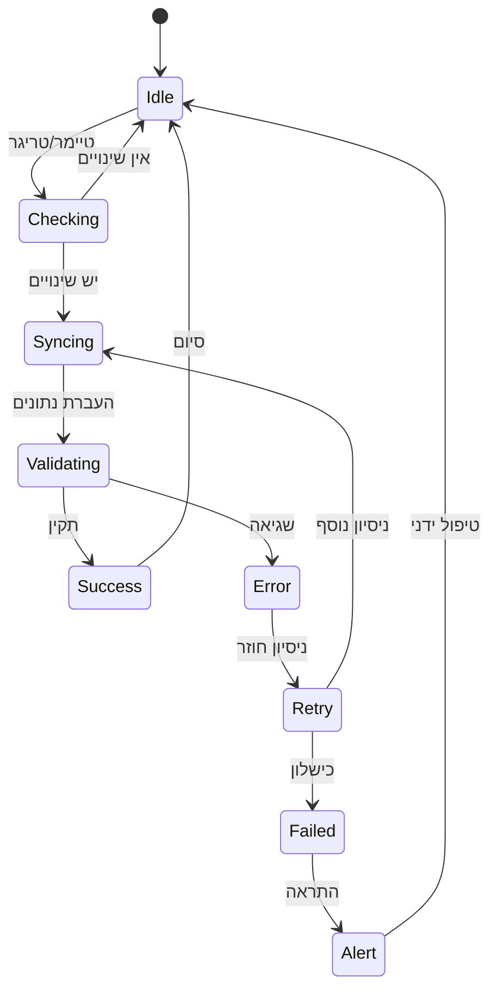

## 🌐 זרימת נתונים בין מודולים

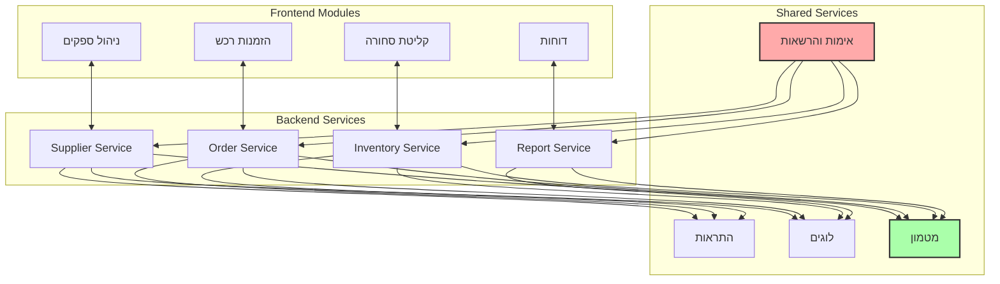

## 📊 מחזור חיי נתונים

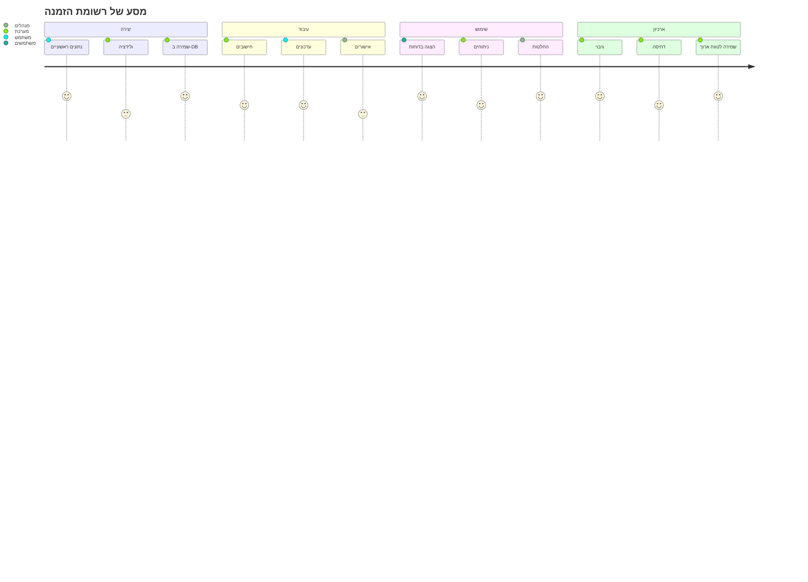

## 🔍 פירוט זרימת קליטת סחורה

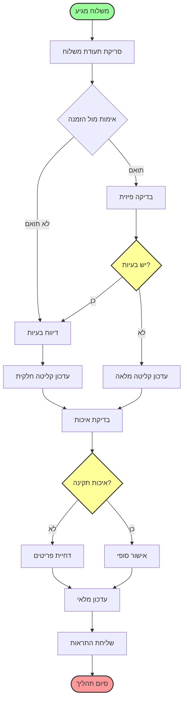

## 💡 המלצות לאופטימיזציה

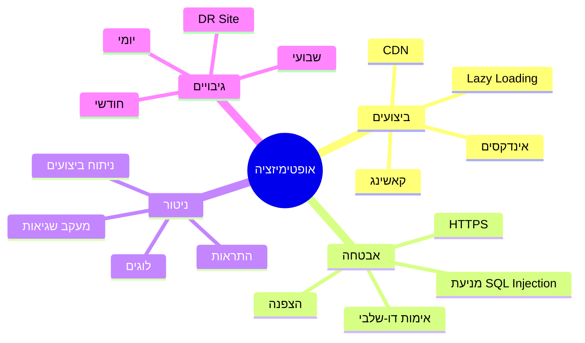

---

## 📝 הערות טכניות

1. **Caching Strategy**: שימוש ב-Redis לשמירת נתונים זמניים
2. **Message Queue**: RabbitMQ לתהליכים אסינכרוניים
3. **API Gateway**: ניהול מרכזי של כל ה-APIs
4. **Load Balancing**: חלוקת עומסים בין שרתים
5. **Monitoring**: שימוש ב-ELK Stack לניטור

---

תאריך עדכון: ינואר 2025 | גרסה: 1.0
