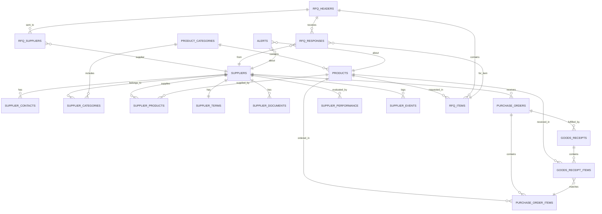
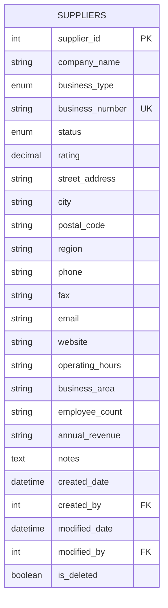
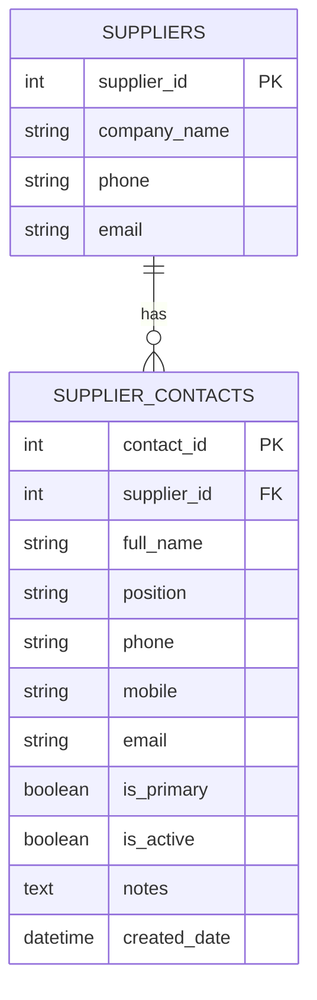
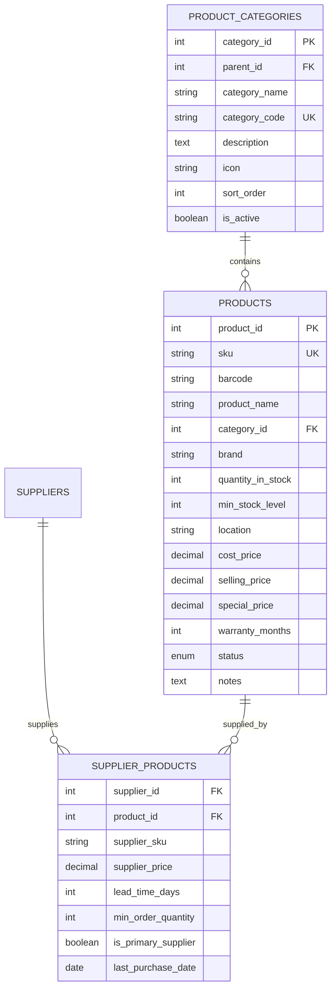
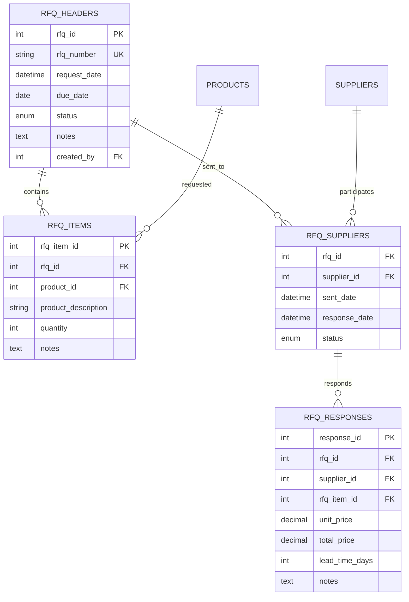
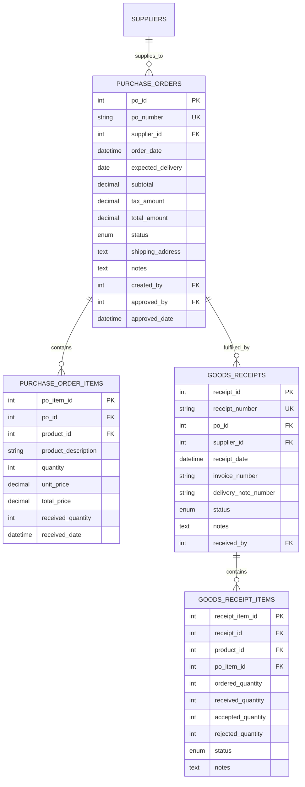
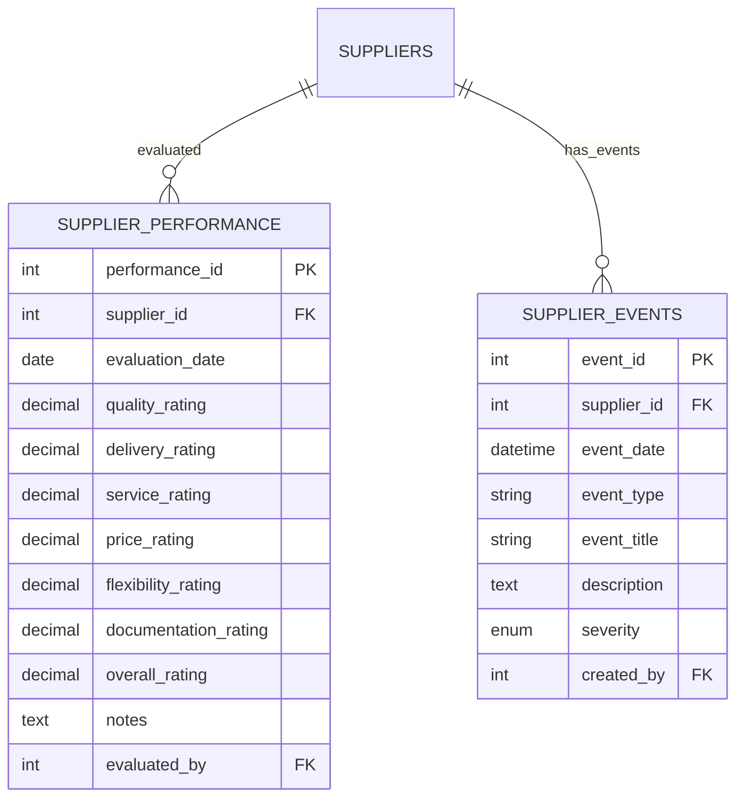
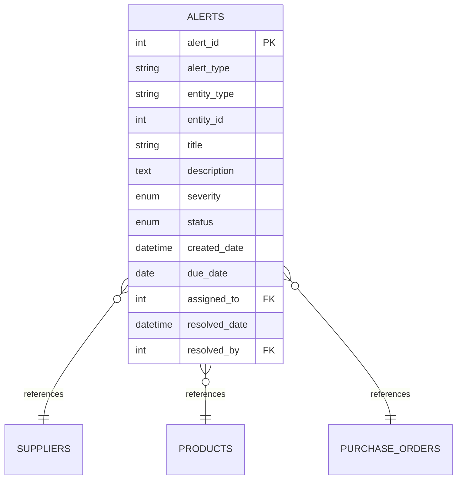
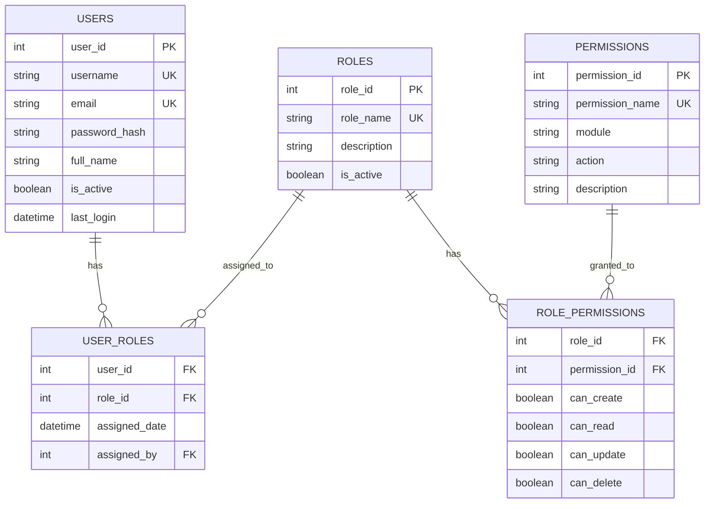
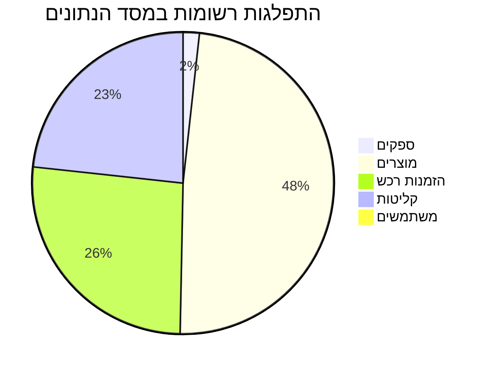

# תרשים ER - Entity Relationship Diagram

## 🗄️ מודל נתונים מלא של המערכת



## 📊 טבלאות ישויות מפורטות

### 1️⃣ טבלת ספקים (SUPPLIERS)



### 2️⃣ מערכת יחסים - אנשי קשר



### 3️⃣ מערכת מוצרים וקטגוריות



### 4️⃣ תהליך RFQ מלא



### 5️⃣ הזמנות רכש וקליטה



### 6️⃣ מערכת הערכה וביצועים



### 7️⃣ מערכת התראות



## 🔑 מפתחות ואינדקסים

```sql
-- Primary Keys
ALTER TABLE suppliers ADD PRIMARY KEY (supplier_id);
ALTER TABLE supplier_contacts ADD PRIMARY KEY (contact_id);
ALTER TABLE products ADD PRIMARY KEY (product_id);
ALTER TABLE purchase_orders ADD PRIMARY KEY (po_id);

-- Foreign Keys
ALTER TABLE supplier_contacts 
    ADD FOREIGN KEY (supplier_id) 
    REFERENCES suppliers(supplier_id);

ALTER TABLE purchase_order_items 
    ADD FOREIGN KEY (po_id) 
    REFERENCES purchase_orders(po_id);

-- Unique Constraints
ALTER TABLE suppliers 
    ADD UNIQUE KEY uk_business_number (business_number);

ALTER TABLE products 
    ADD UNIQUE KEY uk_sku (sku);

-- Indexes for Performance
CREATE INDEX idx_supplier_status ON suppliers(status);
CREATE INDEX idx_supplier_rating ON suppliers(rating);
CREATE INDEX idx_po_order_date ON purchase_orders(order_date);
CREATE INDEX idx_po_status ON purchase_orders(status);
CREATE INDEX idx_product_category ON products(category_id);
CREATE INDEX idx_alert_status ON alerts(status);
CREATE INDEX idx_alert_severity ON alerts(severity);
```

## 📈 Views לדוחות

```sql
-- View: סיכום ספקים
CREATE VIEW v_supplier_summary AS
SELECT 
    s.supplier_id,
    s.company_name,
    s.status,
    s.rating,
    COUNT(DISTINCT po.po_id) as total_orders,
    COALESCE(SUM(po.total_amount), 0) as total_purchase_amount,
    COUNT(DISTINCT sp.product_id) as product_count,
    MAX(po.order_date) as last_order_date
FROM suppliers s
LEFT JOIN purchase_orders po ON s.supplier_id = po.supplier_id
LEFT JOIN supplier_products sp ON s.supplier_id = sp.supplier_id
WHERE s.is_deleted = FALSE
GROUP BY s.supplier_id;

-- View: מצב הזמנות
CREATE VIEW v_order_status_summary AS
SELECT 
    status,
    COUNT(*) as order_count,
    SUM(total_amount) as total_value,
    AVG(DATEDIFF(NOW(), order_date)) as avg_days_pending
FROM purchase_orders
GROUP BY status;
```

## 🔐 הרשאות ואבטחה



## 📊 סטטיסטיקות מסד הנתונים



## 🚀 אופטימיזציה

### אינדקסים מומלצים:
1. **Multi-column indexes** על שדות שמחפשים יחד
2. **Covering indexes** לשאילתות נפוצות
3. **Partial indexes** לסינון נתונים

### Partitioning:
```sql
-- חלוקת טבלת הזמנות לפי שנה
ALTER TABLE purchase_orders 
PARTITION BY RANGE (YEAR(order_date)) (
    PARTITION p2023 VALUES LESS THAN (2024),
    PARTITION p2024 VALUES LESS THAN (2025),
    PARTITION p2025 VALUES LESS THAN (2026),
    PARTITION p_future VALUES LESS THAN MAXVALUE
);
```

---

## 📝 הערות חשובות

1. **Normalization**: המודל בנוי לפי 3NF למניעת כפילויות
2. **Soft Delete**: שימוש ב-is_deleted במקום מחיקה פיזית
3. **Audit Trail**: שמירת created_by ו-modified_by בכל טבלה
4. **Data Types**: שימוש ב-DECIMAL למספרים כספיים
5. **Constraints**: הגדרת CHECK constraints לולידציה

---

תאריך יצירה: ינואר 2025 | גרסת DB: 1.0
