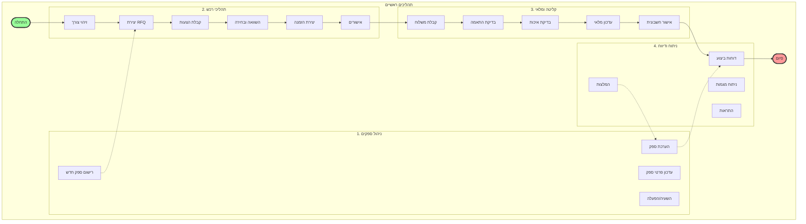
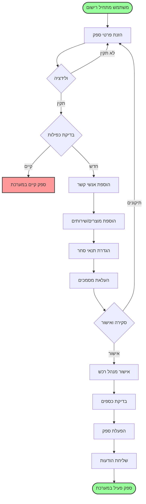
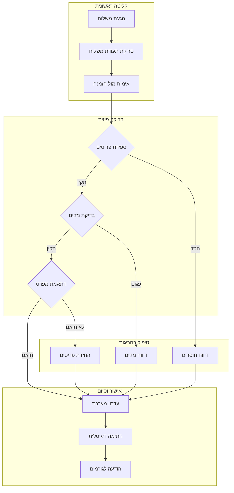
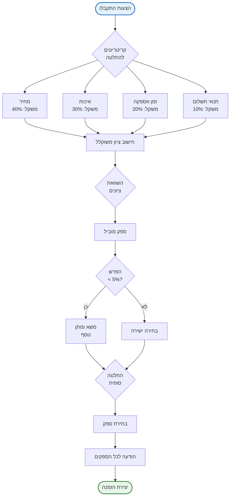
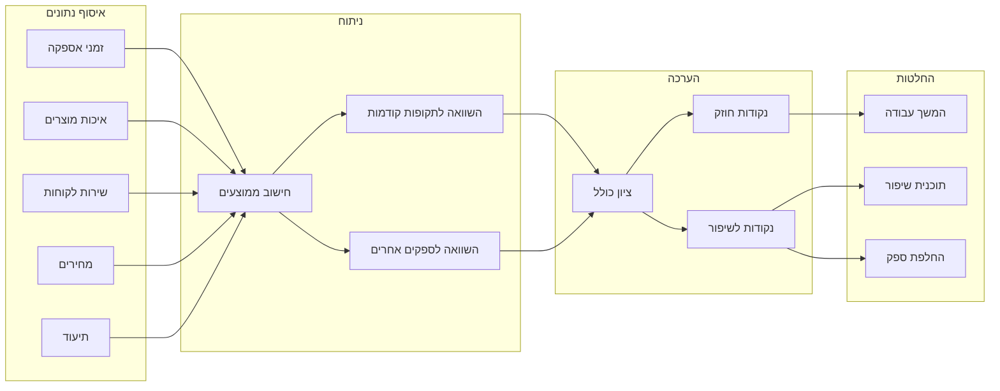
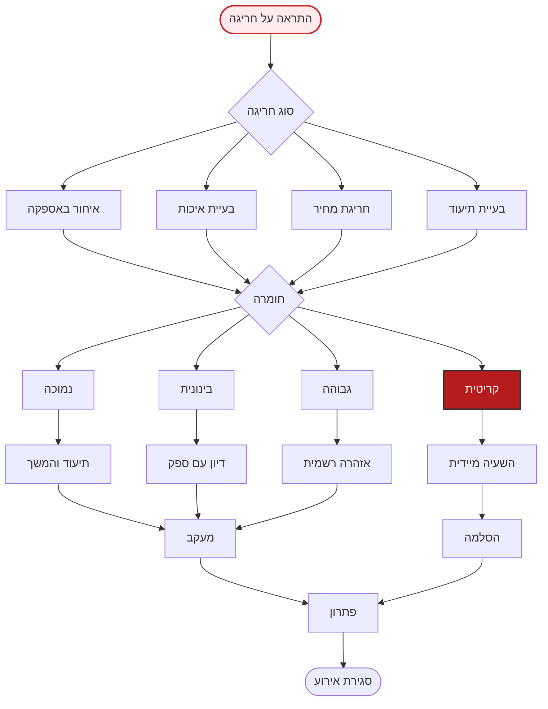
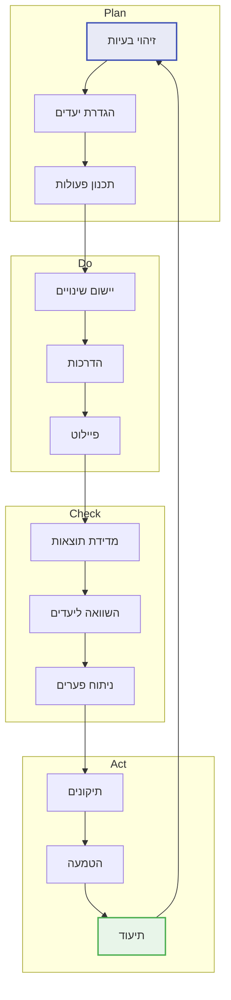
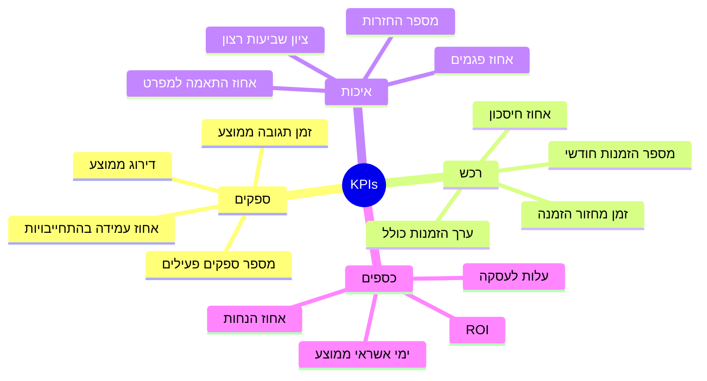
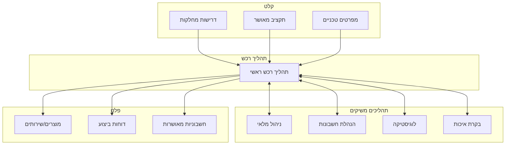

# מפת תהליכים - Process Map

## 🗺️ מפת תהליכים כללית של מערכת הרכש

## 📋 תהליך מפורט - רישום ספק

## 🔄 תהליך RFQ מלא

```mermaid
flowchart LR
    subgraph "שלב 1: יצירה"
        A1[יצירת בקשה]
        A2[הגדרת פריטים]
        A3[קביעת קריטריונים]
    end
    
    subgraph "שלב 2: הפצה"
        B1[בחירת ספקים]
        B2[שליחת בקשות]
        B3[מעקב תגובות]
    end
    
    subgraph "שלב 3: ניתוח"
        C1[איסוף הצעות]
        C2[טבלת השוואה]
        C3[ניקוד משוקלל]
    end
    
    subgraph "שלב 4: החלטה"
        D1[המלצת מערכת]
        D2[אישור מנהל]
        D3[הודעה לזוכה]
    end
    
    A1 --> A2
    A2 --> A3
    A3 --> B1
    B1 --> B2
    B2 --> B3
    B3 --> C1
    C1 --> C2
    C2 --> C3
    C3 --> D1
    D1 --> D2
    D2 --> D3
    
    style A1 fill:#e1f5fe,stroke:#01579b,stroke-width:2px
    style D3 fill:#c8e6c9,stroke:#1b5e20,stroke-width:2px
```

## 🏭 תהליך קליטת סחורה

## 📊 מפת החלטות - בחירת ספק

## 🔍 תהליך הערכת ביצועים

## 🚨 תהליך טיפול בחריגות

## 📈 מחזור שיפור מתמיד

## 🎯 מפת KPIs

## 🔗 אינטגרציה בין תהליכים

---

## 📝 מקרא וסימונים

| סימון | משמעות |
|--------|---------|
| ⭕ | התחלה/סיום |
| ⬜ | פעולה |
| 🔶 | החלטה |
| ➡️ | זרימה רגילה |
| ⚡ | זרימה מותנית |
| 📄 | מסמך |
| 💾 | מסד נתונים |
| 👤 | גורם אנושי |
| 🤖 | תהליך אוטומטי |

---

תאריך עדכון: ינואר 2025 | גרסה: 1.0
