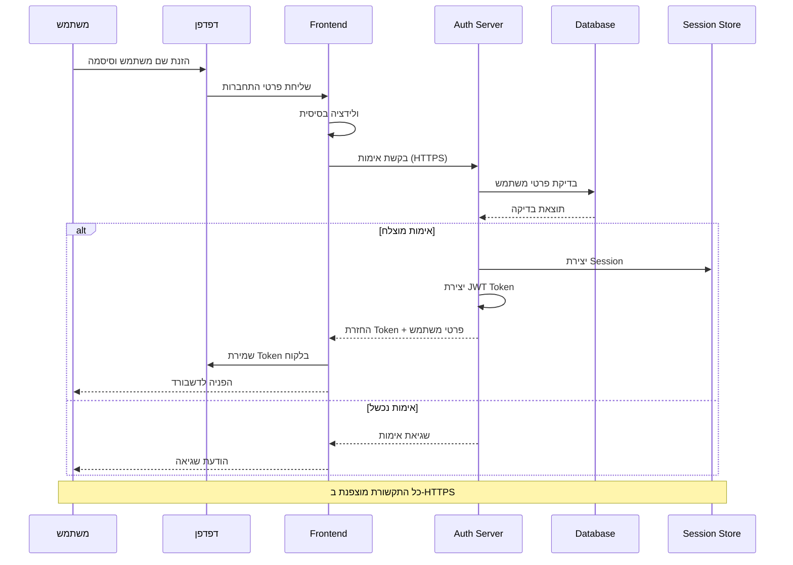
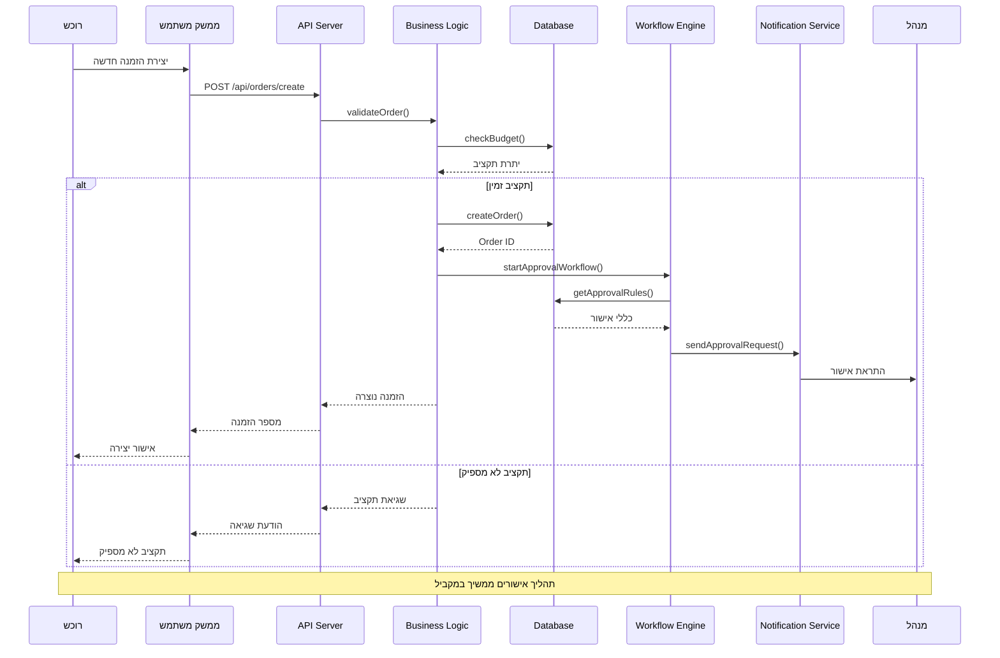
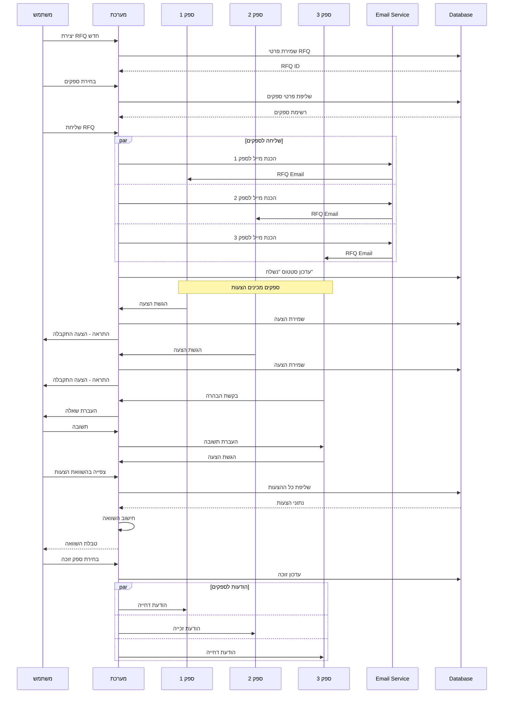
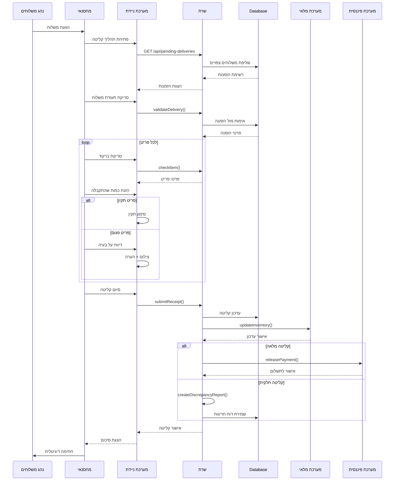
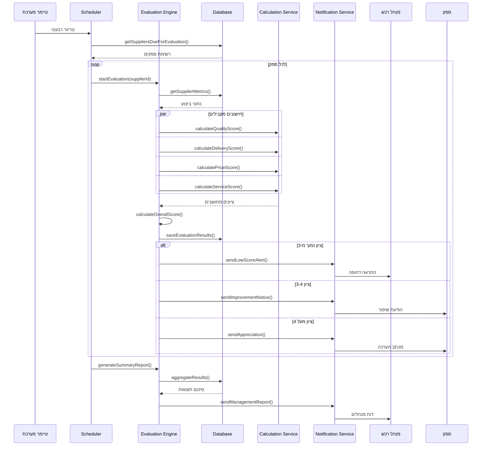
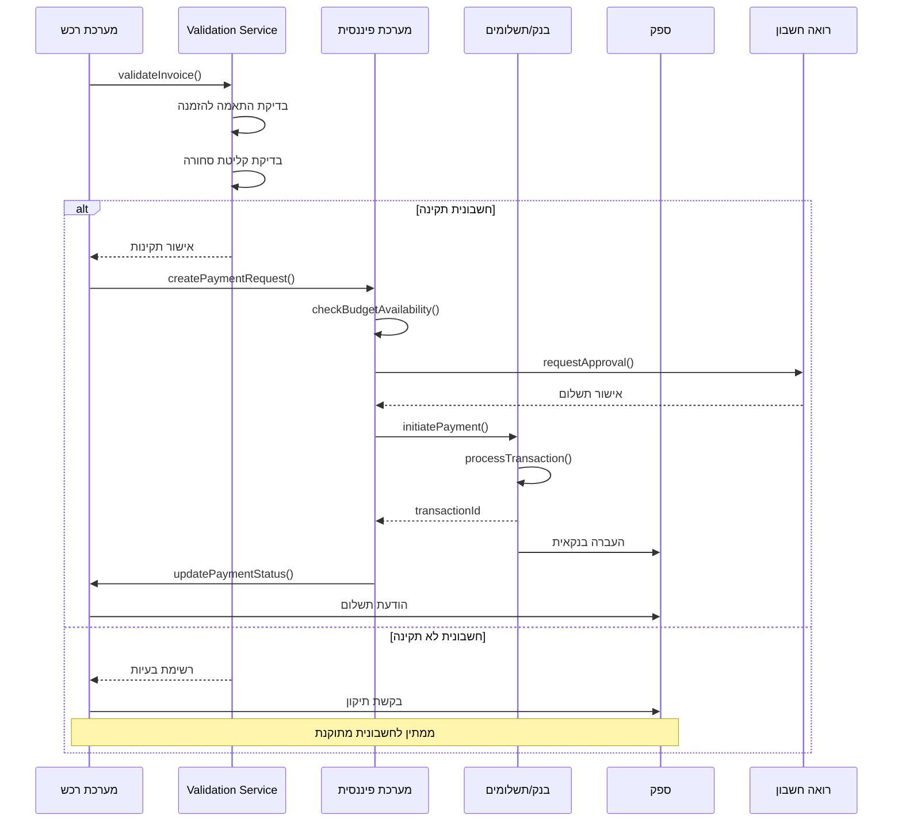
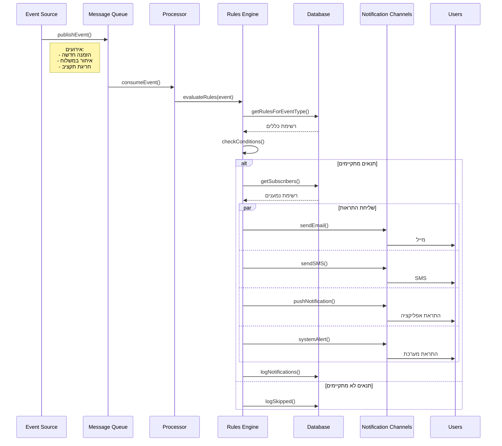
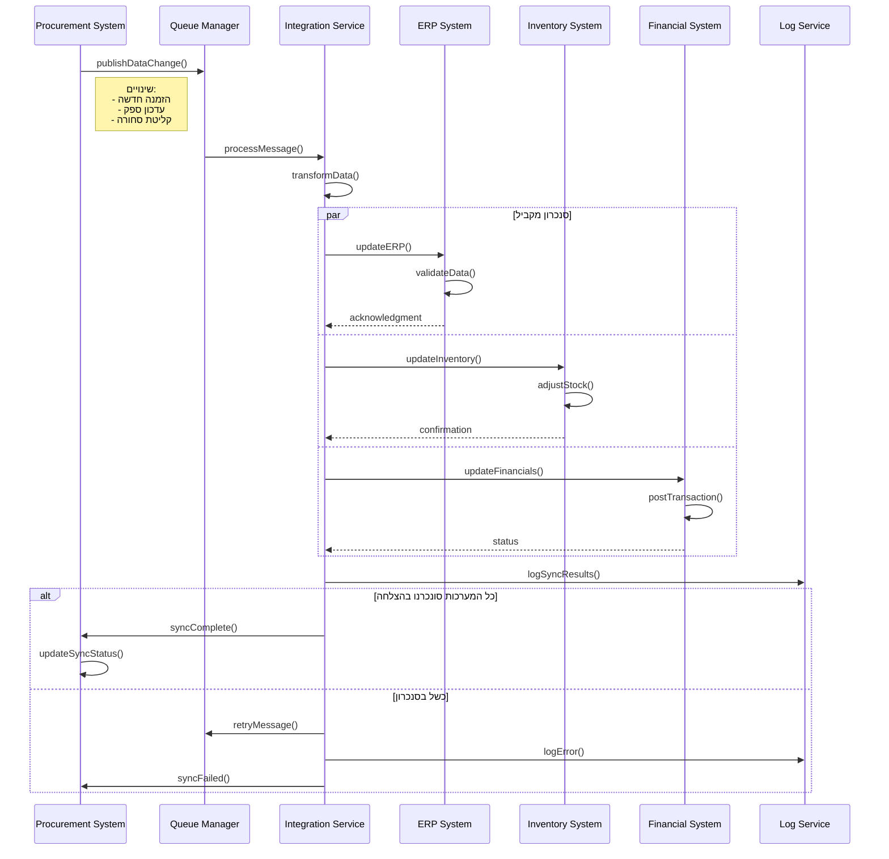
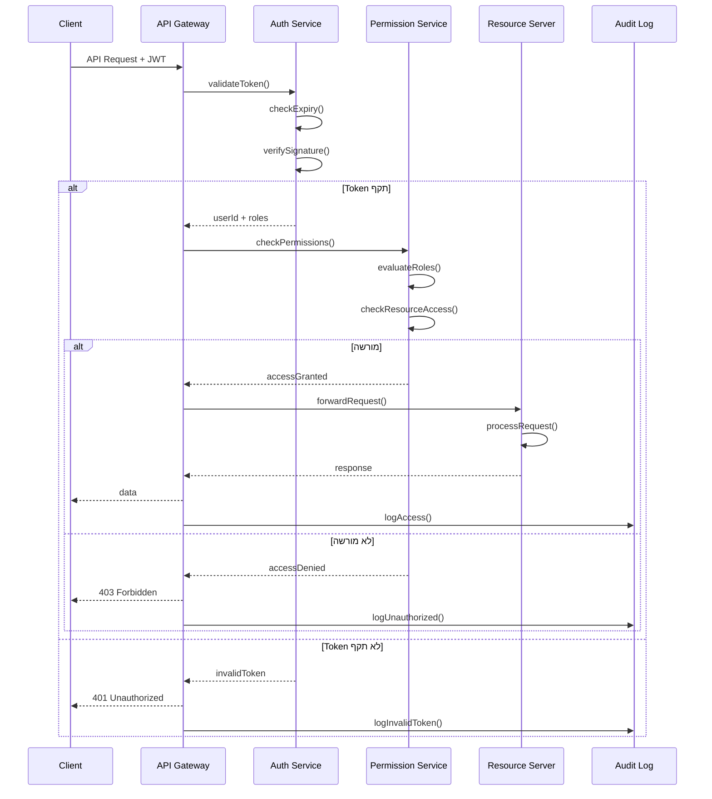
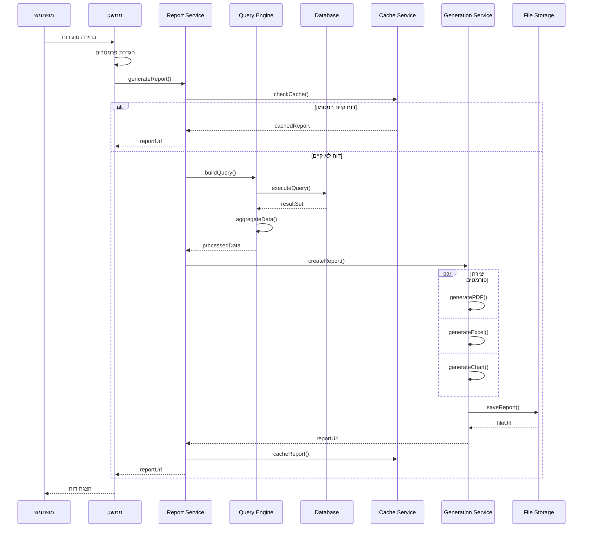

# תרשימי רצף - Sequence Diagrams

## 🔄 תרשים רצף - תהליך התחברות למערכת

## 📋 תרשים רצף - יצירת הזמנת רכש

## 🔍 תרשים רצף - תהליך RFQ מלא

## 📦 תרשים רצף - קליטת סחורה

## 🏆 תרשים רצף - הערכת ספק

## 💰 תרשים רצף - תהליך תשלום

## 🔔 תרשים רצף - מערכת התראות

## 🔄 תרשים רצף - סנכרון נתונים

## 🛡️ תרשים רצף - אבטחה והרשאות

## 📊 תרשים רצף - יצירת דוח

---

## 🔧 כללי תרשימי רצף

### סימונים:
- **Participant** - משתתף בתהליך
- **->** - קריאה סינכרונית
- **->>** - קריאה אסינכרונית  
- **-->>** - תגובה/החזרת ערך
- **alt/else** - תנאים
- **loop** - לולאה
- **par** - פעולות מקביליות
- **Note** - הערה

### עקרונות:
1. **בהירות** - שמות ברורים למשתתפים
2. **פשטות** - לא יותר מ-8 משתתפים
3. **רצף לוגי** - מלמעלה למטה
4. **טיפול בשגיאות** - הצגת מקרי קצה

---

תאריך יצירה: ינואר 2025 | גרסה: 1.0
