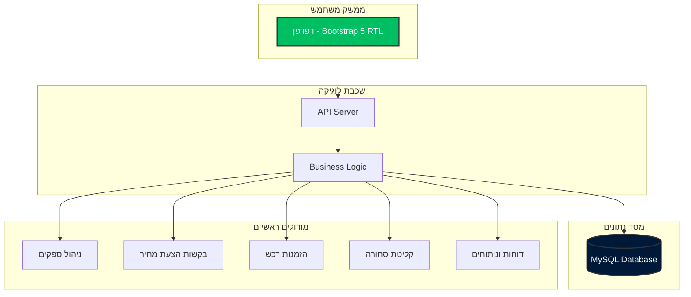
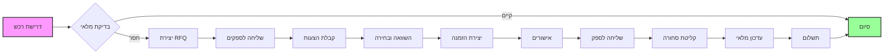
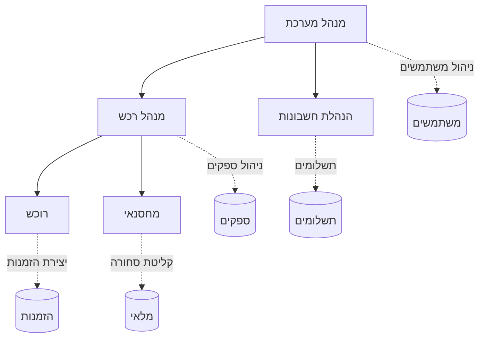
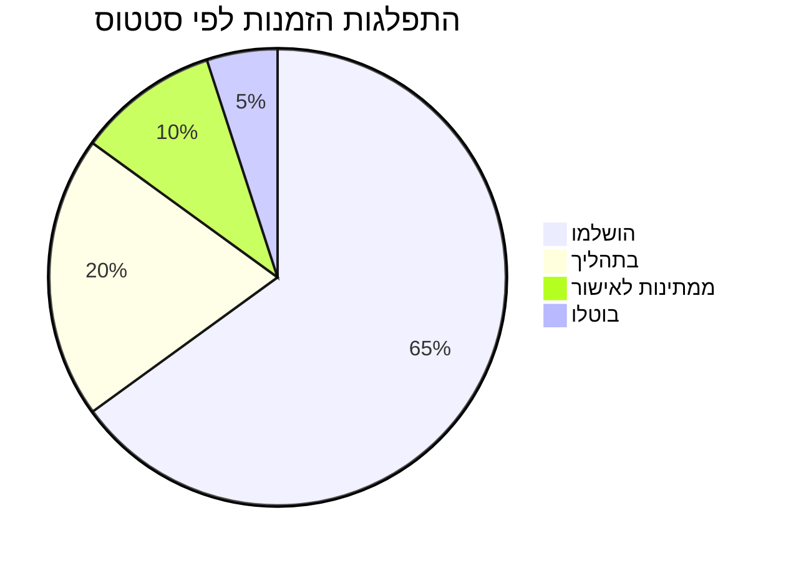
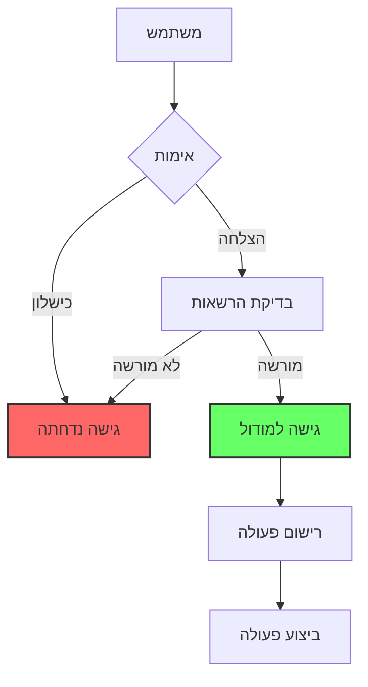
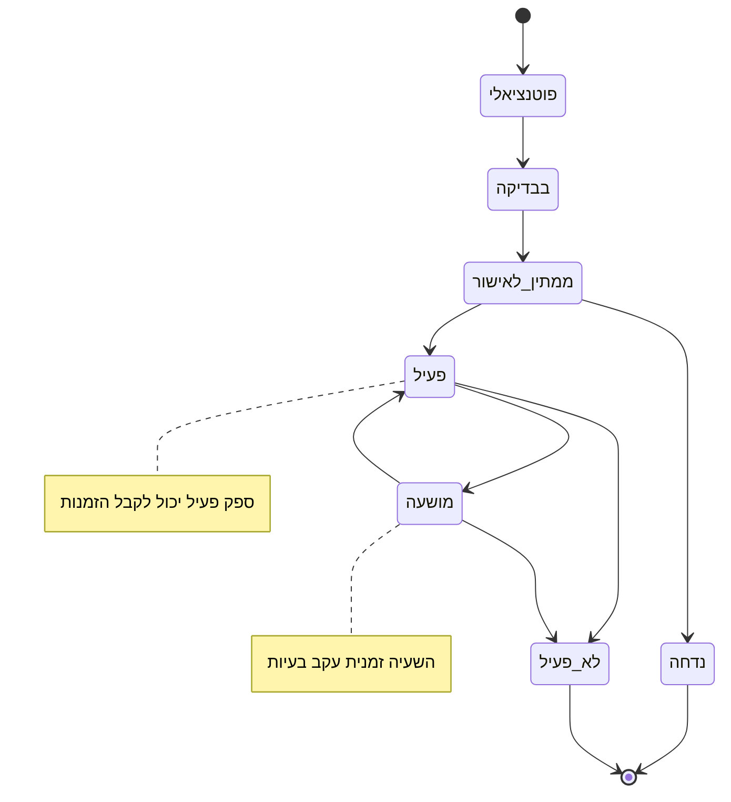
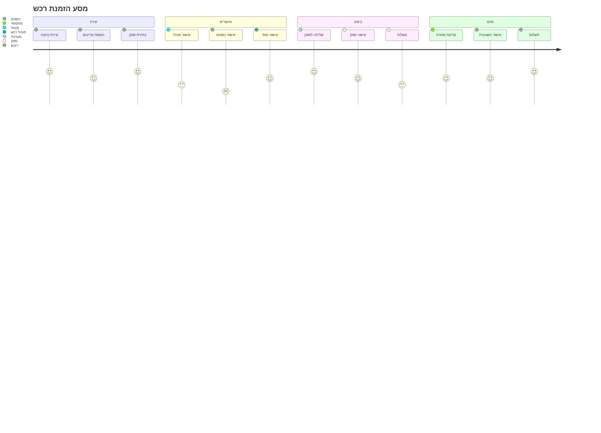
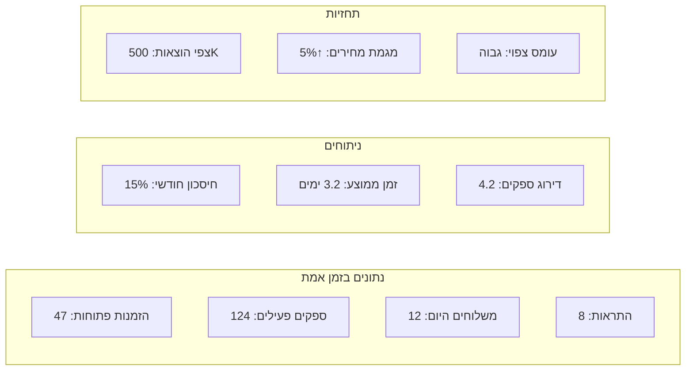
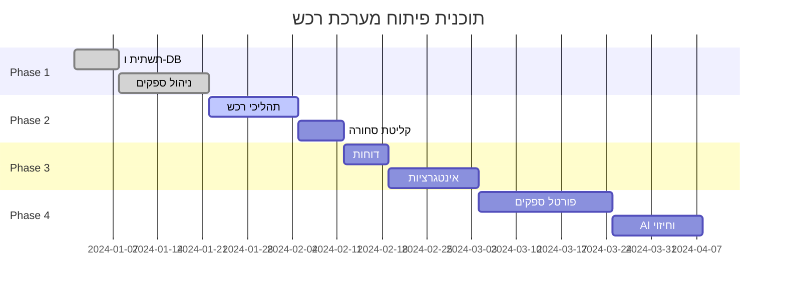

# דיאגרמת סקירה כללית של המערכת

## 🏗️ ארכיטקטורת המערכת



## 🔄 תהליך עבודה ראשי



## 📊 היררכיית משתמשים והרשאות



## 🔗 אינטגרציות חיצוניות

```mermaid
graph LR
    subgraph "מערכת רכש"
        PROC[מערכת רכש]
    end
    
    subgraph "מערכות חיצוניות"
        ERP[ERP ראשי]
        INV[מערכת מלאי]
        FIN[מערכת פיננסית]
        EMAIL[שרת דוא"ל]
        SMS[שירות SMS]
    end
    
    PROC <--> ERP
    PROC --> INV
    PROC <--> FIN
    PROC --> EMAIL
    PROC --> SMS
    
    style PROC fill:#667eea,stroke:#333,stroke-width:4px,color:#fff
```

## 🎯 KPIs ומדדי ביצוע



## 🔐 אבטחת מידע



## 📈 מחזור חיי ספק



## 🔄 מחזור חיי הזמנה



## 🏢 מבנה ארגוני

```mermaid
graph TD
    CEO[מנכ"ל]
    CFO[סמנכ"ל כספים]
    COO[סמנכ"ל תפעול]
    
    CEO --> CFO
    CEO --> COO
    
    CFO --> ACC[מחלקת חשבונות]
    CFO --> BUD[מחלקת תקציב]
    
    COO --> PROC[מחלקת רכש]
    COO --> LOG[מחלקת לוגיסטיקה]
    
    PROC --> PM[מנהל רכש]
    PROC --> PU1[רוכש 1]
    PROC --> PU2[רוכש 2]
    
    LOG --> WM[מנהל מחסן]
    LOG --> WK1[מחסנאי 1]
    LOG --> WK2[מחסנאי 2]
    
    style CEO fill:#f96,stroke:#333,stroke-width:2px
    style PROC fill:#96f,stroke:#333,stroke-width:2px
```

## 📊 Dashboard נתונים



## 🚀 Roadmap פיתוח



---

## 🛠️ הוראות שימוש

### להצגת דיאגרמות Mermaid:

1. **GitHub** - מציג אוטומטית
2. **VS Code** - התקן תוסף Mermaid Preview
3. **Online** - השתמש ב- [mermaid.live](https://mermaid.live)
4. **Export** - ייצוא כ-PNG/SVG

### עדכון דיאגרמות:

```bash
# Clone the repo
git clone [repo-url]

# Edit diagrams
cd workflows/diagrams
edit system-overview.md

# Preview changes
# Use VS Code with Mermaid extension
```

---

צור על ידי: מערכת ניהול רכש ERP | תאריך: ינואר 2025
